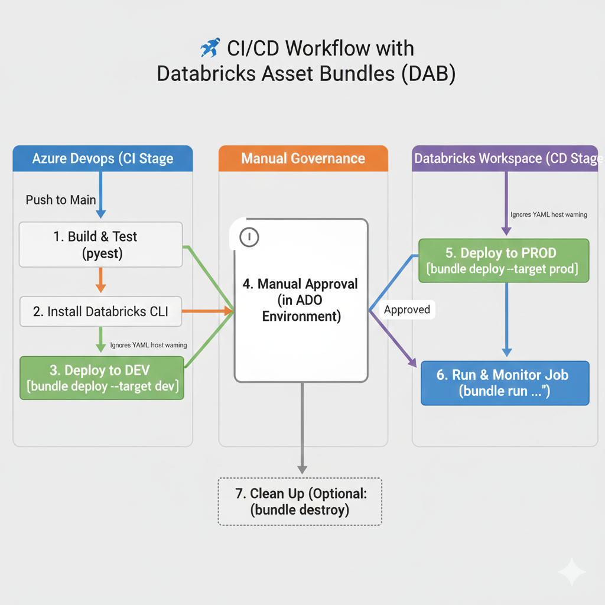

# cicd_databricks_dab



# 🚀 Proyecto de Integración y Despliegue Continuo (CI/CD) en Databricks

Este repositorio contiene la configuración para el flujo de trabajo automatizado que gestiona el despliegue del pipeline de ingesta (`baby-names`) a Databricks, utilizando **Azure DevOps Pipelines** y **Databricks Asset Bundles (DAB)**.

El objetivo es asegurar que el código (Notebooks) pase las pruebas unitarias y se despliegue de forma segura a entornos DEV y PROD.

## ⚠️ NOTA CRÍTICA: Configuración de Host del YAML

El validador de código (Linter) en VS Code puede mostrar un error o advertencia en el archivo `databricks.yml` en las líneas `host: {{env "DBR_HOST_DEV"}}`.

**Causa:** Esta sintaxis es un lenguaje de plantilla de Go (Go Template) que el Linter de VS Code no reconoce como YAML estándar.

**ACCIÓN:** **Ignora el error.** La sintaxis es **correcta y obligatoria** para que el procesador de Databricks CLI lea los secretos de entorno que exporta Azure DevOps.

---

## 🗺️ Fases del Ciclo de Vida de Despliegue (DAB)

El *pipeline* sigue esta secuencia controlada por los *triggers* de Azure DevOps:

| Fase | Tareas | Activador en ADO |
| :--- | :--- | :--- |
| **Integración Continua (CI)** | Pruebas unitarias, `bundle validate`. | `push` a `main`. |
| **Despliegue Continuo (CD)** | `bundle deploy --target prod`. | `dependsOn` (tras CI) y **Aprobación Manual**. |

### 🛠️ Pasos Fundamentales del Bundle

1.  **Crear archivo databricks.yml**
    Define los *jobs*, *resources* (incluido el cómputo `serverless`) y los *targets* (`dev`, `prod`).

2.  **Validar Configuración**
    Verifica la sintaxis del YAML y la estructura del proyecto:
    ```bash
    databricks bundle validate
    ```

3.  **Instalar CLI y Despliegue a DEV (CI)**
    El pipeline de Azure DevOps instala la CLI y usa el siguiente comando para desplegar al entorno de desarrollo:
    ```bash
    # El pipeline exporta Host/Token como variables de entorno
    databricks bundle deploy --target dev
    ```

4.  **Aprobación Manual**
    El Stage de Producción se pausa, requiriendo la aprobación en el *Environment Check* de Azure DevOps.

5.  **Desplegar a PROD (CD)**
    Una vez aprobado, el pipeline finaliza el proceso de Despliegue Continuo (CD):
    ```bash
    databricks bundle deploy --target prod
    ```

6.  **Limpiar Recursos (Opcional)**
    Comando local para eliminar los recursos desplegados por el *bundle* en el Workspace:
    ```bash
    databricks bundle destroy
    ```